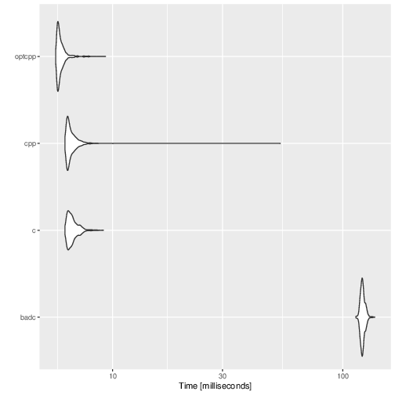

## R Extensions in C versus C++: Judging Size, Speed, and Ease of Use for the Convolution Example

Nothing in this repo is new as the four functions we compare have been part of the [Rcpp](http://www.rcpp.org) source
distribution for many years as part of the (even more extensive) 
[ConvolveBenchmarks](https://github.com/RcppCore/Rcpp/tree/master/inst/examples/ConvolveBenchmarks) examples directory.

But we thought it would be worthwhile to quickly cook them up as _packages_ to compare the final installed size. We
are doing this here in the script `compare.R` which installs these packages (directly from this repo) unless they are
present.  It also uses the 'stripping' feature of the upcoming R 3.6.0 release (due in four weeks) which I 
[recently blogged about](http://dirk.eddelbuettel.com/blog/2019/03/27#021_stripping_take_three).  The four packages
were constructed the same way using [pkgKitten](https://github.com/eddelbuettel/pkgkitten) where the Rcpp use was undone
for the two C packages (for which we added a 'manual' use of `.Call()`).

On my Linux box, after running the `compare.R` script with R-devel, I see the ollowing for the
size of the shared library of the four package versions:

```sh
   badpkgWithoutRcpp       pkgWithoutRcpp          pkgWithRcpp optimisedpkgWithRcpp 
               14064                14232                60256                60264 
```

In essence, using C requires 14 kB whereas C++ uses 60 kB.  Seems like a genormous difference in percentage terms.
But this is for _an R package_ rather than an embedded deviced where we are counting every byte!  For reference, the
most minimal _immediate_ R installation I could get hands on is [37400 kByte](https://packages.debian.org/sid/r-base-core) 
(reported size of package `r-base-core` in Debian 'sid' on amd64).  That is _before_ any recommended packages are installed.
Hence the difference of 46 kB between C and C++ use is about 0.00096 per cent of the _most minimal_ R installation.  For
reference, my `/usr/local/lib/R/site-library` currently clocks in at 948 mB (but that may not be representative).

So I am sure _someone_ cares about such "bloat" of less than 1/1000 of the size of the most minimal (and hence barely
useable) R installation.  But I don't think I do _given it gets me the code shown below_.  Your mileage may, as they say,
vary.

How about performance then?  Well, we started with the two "obvious" uses in the middle.  One is the reference
implementation in _Writing R Extensions_ with all the `PROTECT` / `UNPROTECT` business it requires, additional variables
to walk the vector and all that.   The other is a simple minimal Rcpp implementation just running the double loops.

Now, having mentioned the existing (and somewhat excessive) comparison which shipped with Rcpp for close to a decade, we
were interested in two more corner cases.  First is a very clever use of `Rcpp::Range()` (thanks to Romain) which undoes
one loop.  Now we are actually _writing idiomatic C++_ (in case you are an advanced C++ programmer; I probably would not 
write this in production as it requires familiarity with a little used class etc pp -- but remember we are 
benchmarking here so bear with me).  This shaves off about 20% over bare-bones C which is nothing to sneeze at.

And while we are looking at extreme case, let us consider the case of the less experienced R / C programmer.  Simply
by using _the existing C macro `REAL`_ (which is all over _Writing R Extensions_) we are *completely* destroying the
performance. And no, this is not something "nobody does". A quick search on GitHub among the CRAN-mirrored packages finds
[over 2900 uses of that macro](https://github.com/search?l=C&q=user%3Acran+REAL&type=Code).   

With this description of the four approaches, witness this benchmark result (my box, Intel i7-8700k, Ubuntu 18.10):

```txt
Unit: milliseconds
   expr       min        lq      mean    median        uq       max neval
   badc 114.05212 120.06551 122.03800 121.64487 123.50882 137.60058  1000
      c   6.21450   6.42440   6.70827   6.60331   6.86952   9.11874  1000
    cpp   6.21208   6.36987   6.67039   6.49152   6.76777  53.54561  1000
 optcpp   5.66552   5.78547   5.97899   5.86853   6.04185   9.31412  1000
```

`ggplot2::autoplot()` can visualize this:



Now, compilers differ, OSs differ and whatnot.  So you may get different times.  Different runs sometimes
get different `max` times for when R decides to rearrange its memory.  But the overall result has been 
consistent for me. "Simple" C++ use is the same (or slightly faster) than the verbose and tedious C use.
"Optimised C++" (as an exercise) beats both.  Using `REAL` brings on the end of times.

### Code Snippets

#### Bad C code

```c
// This is from 'Writing R Extensions' section 5.10.1
// BUT slowed down by using REAL() on each access which proves to be rather costly

#include <R.h>
#include <Rdefines.h>

SEXP convolve7(SEXP a, SEXP b)
{
    int i, j, na, nb, nab;
    SEXP ab;

    PROTECT(a = AS_NUMERIC(a));
    PROTECT(b = AS_NUMERIC(b));
    na = LENGTH(a); nb = LENGTH(b); nab = na + nb - 1;
    PROTECT(ab = NEW_NUMERIC(nab));
    for(i = 0; i < nab; i++) REAL(ab)[i] = 0.0;
    for(i = 0; i < na; i++)
    	for(j = 0; j < nb; j++) REAL(ab)[i + j] += REAL(a)[i] * REAL(b)[j];
    UNPROTECT(3);
    return(ab);

}
```

#### Standard C code

```c
/* This is from 'Writing R Extensions' section 5.10.1 */

#include <R.h>
#include <Rdefines.h>

SEXP convolve2(SEXP a, SEXP b)
{
    int i, j, na, nb, nab;
    double *xa, *xb, *xab;
    SEXP ab;

    PROTECT(a = AS_NUMERIC(a));
    PROTECT(b = AS_NUMERIC(b));
    na = LENGTH(a); nb = LENGTH(b); nab = na + nb - 1;
    PROTECT(ab = NEW_NUMERIC(nab));
    xa = NUMERIC_POINTER(a); xb = NUMERIC_POINTER(b);
    xab = NUMERIC_POINTER(ab);
    for(i = 0; i < nab; i++) xab[i] = 0.0;
    for(i = 0; i < na; i++)
	for(j = 0; j < nb; j++) xab[i + j] += xa[i] * xb[j];
    UNPROTECT(3);
    return(ab);
}
```

#### Standard Rcpp use

```c++
// cf example in Rcpp in inst/examples/ConvolveBenchmarks
#include <Rcpp.h>

// [[Rcpp::export]]
Rcpp::NumericVector convolve11cpp(Rcpp::NumericVector & xa,
                                  Rcpp::NumericVector & xb) {
    int n_xa = xa.size();
    int n_xb = xb.size();
    Rcpp::NumericVector xab(n_xa + n_xb - 1);

    for (int i = 0; i < n_xa; i++)
        for (int j = 0; j < n_xb; j++)
            xab[i + j] += xa[i] * xb[j];
    return xab ;
}
```

#### Optimized Rcpp use

```c++
// cf example in Rcpp in inst/examples/ConvolveBenchmarks
#include <Rcpp.h>

// [[Rcpp::export]]
Rcpp::NumericVector convolve5cpp(Rcpp::NumericVector & xa,
                                  Rcpp::NumericVector & xb) {
    int n_xa = xa.size();
    int n_xb = xb.size();
    Rcpp::NumericVector xab(n_xa + n_xb - 1);

    Rcpp::Range r(0, n_xb-1);
    for (int i=0; i<n_xa; i++, r++) {
    	xab[r] += xa[i] * xb;
    }
    return xab;
}
```

### Summary

It is good to have choices. _Writing R Extensions_ is pretty explicit about supporting languages other than C for R
extension. 

As it should be.  Because 
[Chambers (2016)](https://books.google.com/books?id=kxxjDAAAQBAJ&printsec=frontcover&source=gbs_ge_summary_r&cad=0#v=onepage&q&f=false) 
states these three principes in Section 1.1:

- Everything that exists in R is an object. `object`

- Everything that happens in R is a function call. `function`

- Interfaces to other software are part of R. `interface`

It is also important to remember what [Chambers (2008)](https://books.google.com/books/about/Software_for_Data_Analysis.html?id=UXneuOIvhEAC) 
wrote about _The Mission_ for exploration: _[...] to enable the best and most thorough exploration of data possible_
(paraphrased later as _to boldly go where noone has gone before_) as well _The Prime Directive_: _the compuations 
and the software for data analysis should be trustworthy: they should do what they claim, and be seen to do so_.

To me, these two always implied the element of minimal surprise. Allow us to do something _simple enough_ (but not so 
simple that is limiting) with _sufficient performance_ to allow new exploration.  And Rcpp is still my preferred tool
balancing the multiple objectives of _speed_, _ease of use_ and _clarity_.  

But different people will find different solutions preferable, and that is fine.  We have a big tent on purpose.  
May the best tool win.  Rcpp is doing quite allright by that measure as we recently
[passed a million downloads a month](https://twitter.com/eddelbuettel/status/1109213329971650560) while enabling over
sixteen hundred other packages on CRAN to do what they do.


